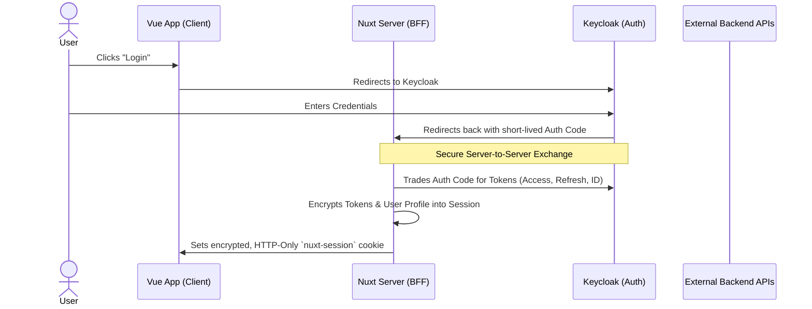

# Nuxt SSR Keycloak Authentication Example

## Setup

You must set up keycloak first and then the repo.

### Keycloak

Spin up a Keycloak instance using Docker:

```bash
docker run -d \                    
  --name keycloak \
  -p 8080:8080 \
  -e KEYCLOAK_ADMIN=admin \
  -e KEYCLOAK_ADMIN_PASSWORD=admin \
  quay.io/keycloak/keycloak:latest \
  start-dev
```

Then create a new realm, I will be calling it 'nuxt-ssr-keycloak'. Ensure that you set it as the current realm in the admin panel.

Then we create a new client. Use the following settings (if a setting isnt listed then just use the default value):

- Client type: OpenID Connect
- Client ID: nuxt-server
- Name: Nuxt Server
- Client authentication: On
- Root URL: http://localhost:3000
- Home URL: http://localhost:3000
- Valid Redirect URIs: http://localhost:3000/api/auth/keycloak
- Web origins: http://localhost:3000

Then we create a new user. Use the following settings:

- Username: test
- Email: test@example.com
- First Name: Test
- Last Name: User

Then we set a password for the user. Go to the credentials tab of the user and set a new password. Ensure that you disable the "Temporary" option.

### Repo

First, install dependencies:

```bash
npm i
```

Then, create a `.env` file in the root of the project with the following content:

- `NUXT_SESSION_PASSWORD` - a random string used to encrypt the session cookie. You can generate one using `openssl rand -hex 32`.
- `NUXT_OAUTH_KEYCLOAK_CLIENT_ID` - The client ID of the Keycloak client you created earlier (e.g. `nuxt-server`).
- `NUXT_OAUTH_KEYCLOAK_CLIENT_SECRET` - The client secret of the Keycloak client you created earlier. You can find this in the Keycloak admin panel under the clients section, by clicking on your client and then going to the "Credentials" tab.
- `NUXT_OAUTH_KEYCLOAK_SERVER_URL` - The URL of your Keycloak server (e.g. `http://localhost:8080`).
- `NUXT_OAUTH_KEYCLOAK_REALM` - The name of the realm you created earlier (e.g. `nuxt-ssr-keycloak`).

Then, start the development server:

```bash
npm run dev
```

## How it works

Unlike traditional Single Page Applications (SPAs) that store sensitive JWTs in the browser (localStorage or insecure cookies), this architecture uses a Backend-for-Frontend (BFF) pattern.

All cryptographic operations and token management are handled securely on the Nuxt Nitro server.
The frontend Vue application has no knowledge of the authentication mechanics.



1. The user clicks the link and logs in on the keycloak UI. Keycloak then redirects the user back to the Nuxt server (`/api/auth/keycloak`) with a temporary authorisation code.
2. The nuxt server then contacts keycloak to trade this code for the real access token and user profile. Because this happens server-to-server there is no chance of this being intercepted on the client side.
3. The nuxt server takes the keycloak tokens and encrypts them using AES-256-GCM (via the `NUXT_SESSION_PASSWORD` environment variable).
4. This encrypted payload is then sent to the user's browser to be stored in the `nuxt-session` cookie. It is flagged as HttpOnly (invisible to JS) and Secure (HTTPS only).
5. When the frontend needs to display user informaation, it makes a request to the Nuxt server to fetch the session state. The server decrypts the cookie, extracts only the safe profile data (never exposing raw tokens), and sends it back to the frontend for rendering.

This way the frontend can show the user is logged in and display their name/email without ever having access to the actual tokens or authentication logic, which are securely handled on the server.

This method does however require us to use a proxy pattern for any API calls that require authentication:

1. Instead of calling external APIs directly from the app, we send it to the nuxt server (`/server/api/backend/[...].ts`)
2. The browser automatically attaches the encryped `nuxt-session` cookie.
3. The nuxt server decrypts the cookie and extracts the hidden Keycloak Access Token.
4. Nuxt forwards the request to the real external API, injecting the `Authorization: Bearer <token>` header

## Benefits

- **XSS Protection**: Cross-Site Scripting attacks cannot steal our access tokens because they simply do not exist in the browser's memory or storage.
- **Possible CORS problems reduction**: The Vue frontend only ever talks to its own Nuxt backend domain.
- **SSR**: The server is now aware of the user's authentication state and thus can render data on the server side, instead of relying on the client to populate the UI after it has loaded.